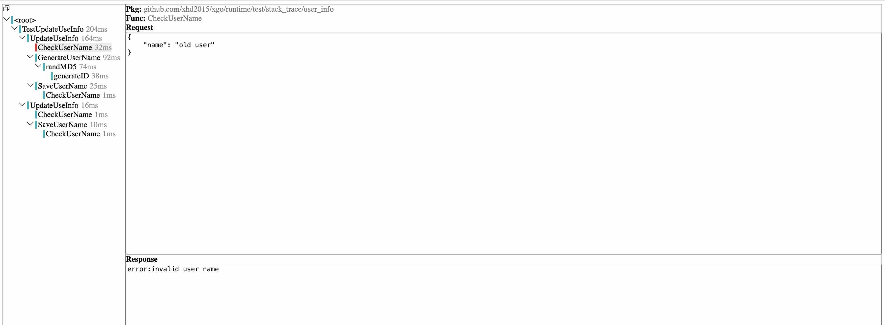

# xgo

[](https://pkg.go.dev/github.com/xhd2015/xgo)
[](https://goreportcard.com/report/github.com/xhd2015/xgo)
[](https://github.com/xhd2015/xgo/actions)
[](https://github.com/xhd2015/xgo/actions)
[](https://github.com/avelino/awesome-go)

**English | [简体中文](./README_zh_cn.md)**

Enable function Trap in `go`, provide tools like Mock and Trace to help go developers write unit test and debug both easier and faster.

`xgo` works as a preprocessor for `go run`,`go build`, and `go test`(see our [blog](https://blog.xhd2015.xyz/posts/xgo-monkey-patching-in-go-using-toolexec)).

It **preprocess** the source code and IR(Intermediate Representation) before invoking `go`, adding missing abilities to go program by cooperating with(or hacking) the go compiler.

These abilities include:
- [Trap](#trap) 
- [Mock](#mock)
- [Trace](#trace)

See [Quick Start](#quick-start) and [Documentation](./doc) for more details.

> *By the way, I promise you this is an interesting project.*

# Installation
```sh
go install github.com/xhd2015/xgo/cmd/xgo@latest
```

Verify the installation:
```sh
xgo version
# output:
#   1.0.x
```

If `xgo` is not found, you may need to check if `$GOPATH/bin` is added to your `PATH` variable.

There are other options,see [doc/INSTALLATION.md](./doc/INSTALLATION.md).

# Requirement
`xgo` requires at least `go1.17` to compile.

There is no specific limitation on OS and Architecture. 

**All OS and Architectures** are supported by `xgo` as long as they are supported by `go`.
|         | x86 | x86_64 (amd64)  | arm64     | any other Arch...     |
|:---------|:-----------:|:-----------:|:-----------:|:-----------:|
| Linux   | Y | Y | Y | Y |
| Windows | Y | Y | Y | Y |
| macOS   | Y | Y | Y | Y |
| any other OS... | Y | Y | Y | Y|

# Quick Start
Let's write a unit test with `xgo`:

1. Ensure you have installed `xgo` by following the [Installation](#installation) section, and verify the installation with:
```sh
xgo version
# output
#   1.0.x
```

2. Init a go project:
```sh
mkdir demo
cd demo
go mod init demo
```
3. Add `demo_test.go` with following code:
```go
package demo_test

import (
	"context"
	"testing"

	"github.com/xhd2015/xgo/runtime/core"
	"github.com/xhd2015/xgo/runtime/mock"
)

func MyFunc() string {
	return "my func"
}

func TestFuncMock(t *testing.T) {
	mock.Mock(MyFunc, func(ctx context.Context, fn *core.FuncInfo, args core.Object, results core.Object) error {
		results.GetFieldIndex(0).Set("mock func")
		return nil
	})
	text := MyFunc()
	if text != "mock func" {
		t.Fatalf("expect MyFunc() to be 'mock func', actual: %s", text)
	}
}
```
4. Get the `xgo/runtime` dependency:
```sh
go get github.com/xhd2015/xgo/runtime
```
5. Run the code:
```sh
# NOTE: xgo will take some time 
# for the first time to setup.
# It will be as fast as go after setup.
xgo test -v ./
```

Output:
```sh
=== RUN   TestFuncMock
--- PASS: TestFuncMock (0.00s)
PASS
ok      demo
```

If you run this with go, it would fail:
```sh
go test -v ./
```

Output:
```sh
WARNING: failed to link __xgo_link_on_init_finished(requires xgo).
WARNING: failed to link __xgo_link_on_goexit(requires xgo).
=== RUN   TestFuncMock
WARNING: failed to link __xgo_link_set_trap(requires xgo).
WARNING: failed to link __xgo_link_init_finished(requires xgo).
    demo_test.go:21: expect MyFunc() to be 'mock func', actual: my func
--- FAIL: TestFuncMock (0.00s)
FAIL
FAIL    demo    0.771s
FAIL
```

The above demo can be found at [doc/demo](./doc/demo).

# API
## Trap
Trap allows developer to intercept function execution on the fly.

Trap is the core of `xgo` as it is the basis of other abilities like Mock and Trace.

The following example logs function execution trace by adding a Trap interceptor:

(check [test/testdata/trap/trap.go](test/testdata/trap/trap.go) for more details.)
```go
package main

import (
    "context"
    "fmt"

    "github.com/xhd2015/xgo/runtime/core"
    "github.com/xhd2015/xgo/runtime/trap"
)

func init() {
    trap.AddInterceptor(&trap.Interceptor{
        Pre: func(ctx context.Context, f *core.FuncInfo, args core.Object, results core.Object) (interface{}, error) {
            if f.Name == "A" {
                fmt.Printf("trap A\n")
                return nil, nil
            }
            if f.Name == "B" {
                fmt.Printf("abort B\n")
                return nil, trap.ErrAbort
            }
            return nil, nil
        },
    })
}

func main() {
    A()
    B()
}

func A() {
    fmt.Printf("A\n")
}

func B() {
    fmt.Printf("B\n")
}
```

Run with `go`:

```sh
go run ./
# output:
#   A
#   B
```

Run with `xgo`:

```sh
xgo run ./
# output:
#   trap A
#   A
#   abort B
```

`AddInterceptor()` add given interceptor to either global or local, depending on whether it is called from `init` or after `init`:
- Before `init`: effective globally for all goroutines,
- After `init`: effective only for current goroutine, and will be cleared after current goroutine exits.

When `AddInterceptor()` is called after `init`, it will return a dispose function to clear the interceptor earlier before current goroutine exits.

Example:

```go
func main(){
    clear := trap.AddInterceptor(...)
    defer clear()
    ...
}
```

Trap also have a helper function called `Direct(fn)`, which can be used to bypass any trap and mock interceptors, calling directly into the original function.

## Mock
Mock simplifies the process of setting up Trap interceptors. 

> API details: [runtime/mock/README.md](runtime/mock)

The Mock API:
- `Mock(fn, interceptor)`

Cheatsheet:
```go
// package level func
mock.Mock(SomeFunc, interceptor)

// per-instance method
// only the bound instance `v` will be mocked
// `v` can be either a struct or an interface
mock.Mock(v.Method, interceptor)

// per-TParam generic function
// only the specified `int` version will be mocked
mock.Mock(GenericFunc[int], interceptor)

// per TParam and instance generic method
v := GenericStruct[int]
mock.Mock(v.Method, interceptor)

// closure can also be mocked
// less used, but also supported
mock.Mock(closure, interceptor)
```

Parameters:
- If `fn` is a simple function(i.e. a package level function, or a function owned by a type, or a closure(yes, we do support mocking closures)),then all call to that function will be intercepted, 
- If `fn` is a method(i.e. `file.Read`),then only call to the instance will be intercepted, other instances will not be affected

Scope:
- If `Mock` is called from `init`, then all goroutines will be mocked.
- Otherwise, `Mock` is called after `init`, then the mock interceptor will only be effective for current goroutine, other goroutines are not affected.

Interceptor Signature: `func(ctx context.Context, fn *core.FuncInfo, args core.Object, results core.Object) error`
- If the interceptor returns `nil`, then the target function is mocked,
- If the interceptor returns `mock.ErrCallOld`, then the target function is called again,
- Otherwise, the interceptor returns a non-nil error, that will be set to the function's return error.

There are other 2 APIs can be used to setup mock based on name, check [runtime/mock/README.md](runtime/mock/README.md) for more details.

Method mock example:
```go
type MyStruct struct {
    name string
}
func (c *MyStruct) Name() string {
    return c.name
}

func TestMethodMock(t *testing.T){
    myStruct := &MyStruct{
        name: "my struct",
    }
    otherStruct := &MyStruct{
        name: "other struct",
    }
    mock.Mock(myStruct.Name, func(ctx context.Context, fn *core.FuncInfo, args core.Object, results core.Object) error {
        results.GetFieldIndex(0).Set("mock struct")
        return nil
    })

    // myStruct is affected
    name := myStruct.Name()
    if name!="mock struct"{
        t.Fatalf("expect myStruct.Name() to be 'mock struct', actual: %s", name)
    }

    // otherStruct is not affected
    otherName := otherStruct.Name()
    if otherName!="other struct"{
        t.Fatalf("expect otherStruct.Name() to be 'other struct', actual: %s", otherName)
    }
}
```

**Notice for mocking stdlib**: due to performance and security impact, only a few packages and functions of stdlib can be mocked, the list can be found at [runtime/mock/stdlib.md](./runtime/mock/stdlib.md). If you want to mock additional stdlib functions, please file a discussion in [Issue#6](https://github.com/xhd2015/xgo/issues/6).

## Patch
The `runtime/mock` package also provides another api:
- `Patch(fn,replacer) func()`

Parameters:
- `fn` same as described in [Mock](#mock) section
- `replacer` another function that will replace `fn`

NOTE: `fn` and `replacer` should have the same signature.

Return:
- a `func()` can be used to remove the replacer earlier before current goroutine exits

Patch replaces the given `fn` with `replacer` in current goroutine. It will remove the replacer once current goroutine exits.

Example:
```go
package patch_test

import (
	"testing"

	"github.com/xhd2015/xgo/runtime/mock"
)

func greet(s string) string {
	return "hello " + s
}

func TestPatchFunc(t *testing.T) {
	mock.Patch(greet, func(s string) string {
		return "mock " + s
	})

	res := greet("world")
	if res != "mock world" {
		t.Fatalf("expect patched result to be %q, actual: %q", "mock world", res)
	}
}
```

NOTE: `Mock` and `Patch` supports top-level variables and consts, see [runtime/mock/MOCK_VAR_CONST.md](runtime/mock/MOCK_VAR_CONST.md).

## Trace
It is painful when debugging with a deep call stack.

Trace addresses this issue by collecting the hierarchical stack trace and stores it into file for later use.

Needless to say, with Trace, debug becomes less usual:

(check [test/testdata/trace/trace.go](test/testdata/trace/trace.go) for more details.)
```go
package main

import (
    "fmt"

    "github.com/xhd2015/xgo/runtime/trace"
)

func init() {
    trace.Enable()
}

func main() {
    A()
    B()
    C()
}
func A() { fmt.Printf("A\n") }
func B() { fmt.Printf("B\n");C(); }
func C() { fmt.Printf("C\n") }
```

Run with `go`:

```sh
go run ./
# output:
#   A
#   B
#   C
#   C
```

Run with `xgo`:

```sh
XGO_TRACE_OUTPUT=stdout xgo run ./
# output a JSON representing the call stacktrace like:
#        {
#            "Name": "main",
#            "Children": [{
#                 "Name": "A"
#                },{
#                  "Name": "B",
#                  "Children": [{
#                       "Name": "C"
#                   }]
#                },{
#                   "Name": "C"
#                }
#            ]
#        }
#
# NOTE: other fields are omitted for displaying key information.
```

You can view the trace with:`xgo tool trace TestExample.json`

Output:


By default, Trace will write traces to a temp directory under current working directory. This behavior can be overridden by setting `XGO_TRACE_OUTPUT` to different values:
- `XGO_TRACE_OUTPUT=stdout`: traces will be written to stdout, for debugging purpose,
- `XGO_TRACE_OUTPUT=<dir>`: traces will be written to `<dir>`,
- `XGO_TRACE_OUTPUT=off`: turn off trace.

# Concurrent safety
I know you guys from other monkey patching library suffer from the unsafety implied by these frameworks.

But I guarantee you mocking in xgo is builtin concurrent safe. That means, you can run multiple tests concurrently as long as you like.

Why? when you run a test, you setup some mock, these mocks will only affect the goroutine test running the test. And these mocks get cleared when the goroutine ends, no matter the test passed or failed.

Want to know why? Stay tuned, we are working on internal documentation.

# Implementation Details
> Working in progress...

See [Issue#7](https://github.com/xhd2015/xgo/issues/7) for more details.

This blog has a basic explanation: https://blog.xhd2015.xyz/posts/xgo-monkey-patching-in-go-using-toolexec

# Why `xgo`?
The reason is simple: **NO** interface.

Yes, no interface, just for mocking. If the only reason to abstract an interface is to mock, then it only makes me feel boring, not working.

Extracting interface just for mocking is never an option to me. To the domain of the problem, it's merely a workaround. It enforces the code to be written in one style, that's why we don't like it.

Monkey patching simply does the right thing for the problem. But existing library are bad at compatibility.

So I created `xgo`, and hope it will finally take over other solutions to the mocking problem.

# Comparing `xgo` with `monkey`
The project [bouk/monkey](https://github.com/bouk/monkey), was initially created by bouk, as described in his blog https://bou.ke/blog/monkey-patching-in-go.

In short, it uses a low level assembly hack to replace function at runtime. Which exposes lots of confusing problems to its users as it gets used more and more widely(especially on macOS).

Then it was archived and no longer maintained by the author himself. However, two projects later take over the ASM idea and add support for newer go versions and architectures like Apple M1.

Still, the two does not solve the underlying compatibility issues introduced by ASM, including cross-platform support, the need to write to a read-only section of the execution code and lacking of general mock.

So developers still get annoying failures every now and then.

Xgo managed to solve these problems by avoiding low level hacking of the language itself. Instead, it relies on the IR representation employed by the go compiler.

It does a so-called `IR Rewriting` on the fly when the compiler compiles the source code. The IR(Intermediate Representation) is closer to the source code rather than the machine code. Thus it is much more stable than the monkey solution.

In conclusion, `xgo` and monkey are compared as the following:
||xgo|monkey|
|-|-|-|
|Technique|IR|ASM|
|Function Mock|Y|Y|
|Unexported Function Mock|Y|N|
|Per-Instance Method Mock|Y|N|
|Per-Goroutine Mock|Y|N|
|Per-Generic Type Mock|Y|Y|
|Var Mock|Y|N|
|Const Mock|Y|N|
|Closure Mock|Y|Y|
|Stack Trace|Y|N|
|General Trap|Y|N|
|Compatiblility|NO LIMIT|limited to amd64 and arm64|
|API|simple|complex|
|Integration Effore|easy|hard|

# Contribution
Want to help contribute to `xgo`? Great! Check [CONTRIBUTING
](CONTRIBUTING.md) for help.

# Evolution of `xgo`
`xgo` is the successor of the original [go-mock](https://github.com/xhd2015/go-mock), which works by rewriting go code before compile.

The strategy employed by `go-mock` works well but causes much longer build time for larger projects due to source code explosion.

However, `go-mock` is remarkable for it's discovery of Trap, Trace besides Mock, and additional abilities like trapping variable and disabling map randomness.

It is the shoulder which `xgo` stands on.
