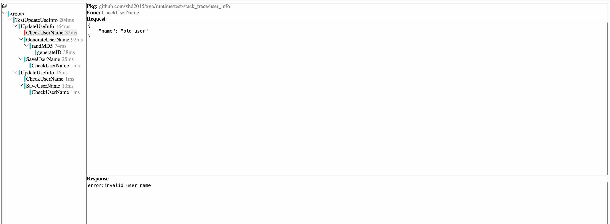
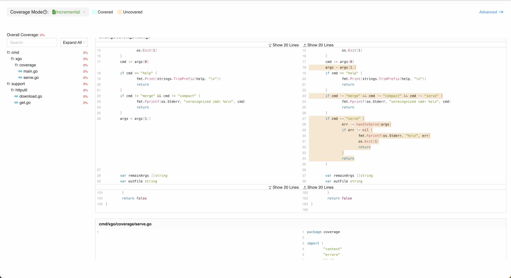

# xgo
[](https://pkg.go.dev/github.com/xhd2015/xgo)
[](https://goreportcard.com/report/github.com/xhd2015/xgo)
[](https://join.slack.com/t/golang-xgo/shared_invite/zt-2ixe161jb-3XYTDn37U1ZHZJSgnQi6sg)
[](https://github.com/xhd2015/xgo/actions)
[](https://github.com/xhd2015/xgo/actions)
[](https://github.com/avelino/awesome-go)

**[English](./README.md) | 简体中文**

> 分享视频: [#151 xgo: 基于编译期代码重写实现 Mock 和 Trace【Go 夜读】](https://www.bilibili.com/video/BV11D421A7zW)

`xgo`提供了一个*全功能*的Golang测试工具集, 包括:

- [API](#api)
  - [Mock](#patch)
  - [Trace](#trace)
  - [Trap](#trap)
- [工具](#工具)
  - [Test Explorer](#test-explorer)
  - [增量覆盖率](#增量覆盖率)
- [IDE集成](#ide集成)

就Mock而言，`xgo`作为一个预处理器工作在`go run`,`go build`,和`go test`之上(查看[blog](https://blog.xhd2015.xyz/zh/posts/xgo-monkey-patching-in-go-using-toolexec))。

`xgo`对源代码和IR(中间码)进行预处理之后, 再调用`go`进行后续的编译工作。通过这种方式, `xgo`实现了一些在`go`中缺乏的能力。

更多细节, 参见[快速开始](#快速开始)和[文档](./doc)。

[](https://youtu.be/L8oPhgqtdGg)


> *顺便说一下, 我可以向你保证这是一个有趣的项目。*

# 安装
```sh
go install github.com/xhd2015/xgo/cmd/xgo@latest
```

验证:
```sh
xgo version
# 输出:
#   1.0.x

xgo help
# 输出: xgo使用帮助
```
如果未找到`xgo`, 你可能需要查看`$GOPATH/bin`是否已经添加到你的`PATH`变量中。

对于CI, 如github workflow, 参考[doc/INSTALLATION.md](./doc/INSTALLATION.md).

# 使用须知
`xgo` 需要`go1.17`及以上的版本。

对OS和Arch没有限制, `xgo`支持所有`go`支持的OS和Arch。

|         | x86 | x86_64 (amd64)  | arm64     | 任何其他架构...     |
|:---------|:-----------:|:-----------:|:-----------:|:-----------:|
| Linux   | Y | Y | Y | Y |
| Windows | Y | Y | Y | Y |
| macOS   | Y | Y | Y | Y |
| 任何其他OS...    | Y | Y | Y | Y|

# 快速开始
我们基于`xgo`编写一个单元测试:

1. 确保`xgo`已经安装了, 参考[安装](#安装), 通过下面的命令验证:
```sh
xgo version
# 输出
#   1.0.x
```

2. 创建一个demo工程:
```sh
mkdir demo
cd demo
go mod init demo
```
3. 将下面的内容添加到文件`demo_test.go`中:
```go
package demo_test

import (
	"testing"

	"github.com/xhd2015/xgo/runtime/mock"
)

func MyFunc() string {
	return "my func"
}

func TestFuncMock(t *testing.T) {
	mock.Patch(MyFunc, func() string {
		return "mock func"
	})
	text := MyFunc()
	if text != "mock func" {
		t.Fatalf("expect MyFunc() to be 'mock func', actual: %s", text)
	}
}
```
4. 获取`github.com/xhd2015/xgo/runtime`的依赖:
```sh
go get github.com/xhd2015/xgo/runtime
```
5. 测试代码:
```sh
# 注意: 首次运行xgo可能会花费一点时间来
# 复制文件。后续的运行速度和go一样快
xgo test -v ./
```

输出:
```sh
=== RUN   TestFuncMock
--- PASS: TestFuncMock (0.00s)
PASS
ok      demo
```

如果使用go运行上面的代码, 它会失败:
```sh
go test -v ./
```

输出:
```sh
WARNING: failed to link __xgo_link_on_init_finished(requires xgo).
WARNING: failed to link __xgo_link_on_goexit(requires xgo).
=== RUN   TestFuncMock
WARNING: failed to link __xgo_link_set_trap(requires xgo).
WARNING: failed to link __xgo_link_init_finished(requires xgo).
    demo_test.go:21: expect MyFunc() to be 'mock func', actual: my func
--- FAIL: TestFuncMock (0.00s)
FAIL
FAIL    demo    0.771s
FAIL
```

上面的示例代码可在[doc/demo](./doc/demo)中找到.

# API

## Patch
在当前协程中mock指定的函数。

API:
- `Patch(fn,replacer) func()`

快速参考:
```go
// 包级别函数
mock.Patch(SomeFunc, mockFunc)

// 实例方法
// 只有实例`v`的方法会被mock
// `v`可以是结构体或接口
mock.Patch(v.Method, mockMethod)

// 参数类型级别的范型函数
// 只有`int`参数的才会被mock
mock.Patch(GenericFunc[int], mockFuncInt)

// 实例和参数级别的范型方法
v := GenericStruct[int]
mock.Mock(v.Method, mockMethod)

// 闭包
// 虽然很少需要mock,但支持
mock.Mock(closure, mockFunc)
```

参数:
- 如果`fn`是普通函数(即包级别的函数, 类型的函数或者匿名函数(是的, xgo支持Mock匿名函数)), 则所有对该函数的调用都将被Mock,
- `replacer`一个用来替换`fn`的函数.

影响范围:
- 如果`Patch`在`init`过程中调用, 则该函数在所有的Gorotuine的调用都会被Mock,
- 否则, `Patch`在`init`完成之后调用, 则仅对当前Goroutine生效, 其他Goroutine不受影响.

注意: `replacer`应当和`fn`具有同样的签名。

返回值:
- 一个`func()`, 用来提前移除`replacer`

Patch将`fn`替换为`replacer`,这个替换仅对当前goroutine生效.在当前Goroutine退出后, `replacer`被自动移除。

例子:
```go
package patch_test

import (
	"testing"

	"github.com/xhd2015/xgo/runtime/mock"
)

func greet(s string) string {
	return "hello " + s
}

func TestPatchFunc(t *testing.T) {
	mock.Patch(greet, func(s string) string {
		return "mock " + s
	})

	res := greet("world")
	if res != "mock world" {
		t.Fatalf("expect patched result to be %q, actual: %q", "mock world", res)
	}
}
```

注意: `Mock`和`Patch`也支持对包级别的变量和常量进行mock, 见[runtime/mock/MOCK_VAR_CONST.md](runtime/mock/MOCK_VAR_CONST.md).

**关于标准库Mock的注意事项**: 针对标准库有两种不同的模式，参考[runtime/mock/stdlib.md](./runtime/mock/stdlib.md).

## Mock
`runtime/mock` 还提供了名为`Mock`的API, 它与`Patch`十分类似，唯一的区别是第二个参数接受一个拦截器。

因此，当函数含有未导出类型时，`Patch`无法使用，此时可以使用`Mock`。

> API更多细节: [runtime/mock/README.md](runtime/mock)

Mock的API:
- `Mock(fn, interceptor)`

参数:
- `fn` 与[Patch](#patch)中的第一个参数相同
- 如果`fn`是方法(即实例或接口的方法, 例如`file.Read`), 则只有绑定的实例会被拦截, 其他实例不会被Mock.

拦截器签名: `func(ctx context.Context, fn *core.FuncInfo, args core.Object, results core.Object) error`
- 如果返回`nil`, 则目标函数被Mock,
- 如果返回`mock.ErrCallOld`, 则目标函数会被调用,
- 否则, 返回的其他错误, 会被设置为目标函数的error返回值, 目标函数不会被调用。

Mock还有两个额外的API, 它们基于名称进行拦截, 更多细节，参见[runtime/mock/README.md](runtime/mock/README.md)。

方法Mock示例:
```go
type MyStruct struct {
    name string
}
func (c *MyStruct) Name() string {
    return c.name
}

func TestMethodMock(t *testing.T){
    myStruct := &MyStruct{
        name: "my struct",
    }
    otherStruct := &MyStruct{
        name: "other struct",
    }
    mock.Mock(myStruct.Name, func(ctx context.Context, fn *core.FuncInfo, args core.Object, results core.Object) error {
        results.GetFieldIndex(0).Set("mock struct")
        return nil
    })

    // myStruct受影响
    name := myStruct.Name()
    if name!="mock struct"{
        t.Fatalf("expect myStruct.Name() to be 'mock struct', actual: %s", name)
    }

    // otherStruct不受影响
    otherName := otherStruct.Name()
    if otherName!="other struct"{
        t.Fatalf("expect otherStruct.Name() to be 'other struct', actual: %s", otherName)
    }
}
```

## Trace
> Trace也许是xgo提供的最强大的工具, 这个博客介绍了一个更全面的例子: https://blog.xhd2015.xyz/zh/posts/xgo-trace_a-powerful-visualization-tool-in-go/

在调试一个非常深的调用栈时, 通常会感觉非常痛苦, 并且效率低下。

为了解决这个问题, Trace实现了结构化的调用堆栈信息收集。在Trace的帮助下, 通常不需要很多Debug即可知道函数调用的细节:

```go
package trace_test

import (
    "fmt"
    "testing"
)

func TestTrace(t *testing.T) {
    A()
    B()
    C()
}

func A() { fmt.Printf("A\n") }
func B() { fmt.Printf("B\n");C(); }
func C() { fmt.Printf("C\n") }
```

使用`xgo`运行:

```sh
# 执行测试, 生成TestTrace.json
xgo test --strace ./

# 查看Trace
xgo tool trace TestTrace.json
```

输出:


另一个复杂一些的例子[runtime/test/stack_trace/update_test.go](runtime/test/stack_trace/update_test.go): 


真实项目例子: 
- https://github.com/Shibbaz/GOEventBus/pull/11

使用Trace可以帮助你快速理解代码的执行流程。

默认情况下, Trace会在当前目录下写入堆栈记录, 可通过`--strace-dir=<DIR>`进行控制。

除了使用`--strace`之外, xgo还允许你通过`trace.Trace()`的方式手动控制追踪范围:
```go
import "github.com/xhd2015/xgo/runtime/trace"

func TestTrace(t *testing.T) {
    A()
    trace.Trace(trace.Config{OutputFile:"demo.json"},nil,func() (interface{},error){
        B()
        C()
    return nil,nil
    })
}
```
结果中只会包含`B()`和`C()`.

## Recorder
```go
package main

import (
    "context"
    "fmt"

    "github.com/xhd2015/xgo/runtime/trace"
)

func main() {
    trace.RecordCall(A, func(){
        fmt.Printf("record A\n")
    })
    trace.RecordCall(B,func(){
        fmt.Printf("record B\n")
    })
    A()
    B()
}

func A() {
    fmt.Printf("A\n")
}

func B() {
    fmt.Printf("B\n")
}
```

使用`xgo`运行:

```sh
xgo run ./
# 输出:
#   record A
#   A
#   record B
#   B
```

`RecordCall()`将一个拦截器添加到全局或当前Goroutine,取决于当前是在`init`中还是`init`完成后:
- `init`中: 对所有Goroutine中的函数拦截都生效,
- `init`完成后: 仅对当前Goroutine生效, 并且在当前Goroutine退出后清理.

当在`init`完成之后调用`RecordCall()`, 它还会返回一个额外的清理函数, 用于提前清理设置的拦截器.

## Trap
Trap允许对几乎所有函数进行拦截, 它是`xgo`的核心机制, 是其他功能, 如Mock和Trace的基础。

下面的例子对函数的执行进行拦截并打印日志:

(查看 [test/testdata/trap/trap.go](test/testdata/trap/trap.go) 获取更多细节.)
```go
package main

import (
    "context"
    "fmt"

    "github.com/xhd2015/xgo/runtime/core"
    "github.com/xhd2015/xgo/runtime/trap"
)

func init() {
    trap.AddInterceptor(&trap.Interceptor{
        Pre: func(ctx context.Context, f *core.FuncInfo, args core.Object, results core.Object) (interface{}, error) {
            if f.Name == "A" {
                fmt.Printf("trap A\n")
                return nil, nil
            }
            if f.Name == "B" {
                fmt.Printf("abort B\n")
                return nil, trap.ErrAbort
            }
            return nil, nil
        },
    })
}

func main() {
    A()
    B()
}

func A() {
    fmt.Printf("A\n")
}

func B() {
    fmt.Printf("B\n")
}
```

使用`go`运行:

```sh
go run ./
# 输出:
#   A
#   B
```

使用`xgo`运行:

```sh
xgo run ./
# 输出:
#   trap A
#   A
#   abort B
```

`AddInterceptor()`将一个拦截器添加到全局或当前Goroutine,取决于当前是在`init`中还是`init`完成后:
- `init`中: 对所有Goroutine中的函数拦截都生效,
- `init`完成后: 仅对当前Goroutine生效, 并且在当前Goroutine退出后清理.

当在`init`完成之后调用`AddInterceptor()`, 它还会返回一个额外的清理函数, 用于提前清理设置的拦截器.

例子:

```go
func main(){
    clear := trap.AddInterceptor(...)
    defer clear()
    ...
}
```

# 工具

## Test Explorer

子命令`xgo e`将会打开一个浏览器窗口, 提供给Go开发者一种简单快速的方式来测试和调试Go代码。

使用Test Explorer时，`xgo test`将会替代`go test`来运行测试用例，以便允许对代码进行Mock。

```sh
$ xgo e
Server listen at http://localhost:7070
```


P.S.: `xgo e`是`xgo tool test-explorer`的别名。

运行`xgo e help`来获取帮助。

查看 [doc/test-explorer/README.md](doc/test-explorer) 获取更多配置相关信息。

## 增量覆盖率
子命令`xgo tool coverage`扩展了go内置的`go tool cover`, 提供了更好的覆盖率可视化体验。

首先，运行`go test`或`xgo test`来生成覆盖率文件:
```sh
go test -cover -coverpkg ./... -coverprofile cover.out ./...
``` 

然后，使用`xgo`来展示覆盖率:
```sh
xgo tool coverage serve cover.out
```

展示效果:



展示结果是覆盖率和git diff的组合。默认情况下，只有变更的行会被展示:
- 已经覆盖的行展示为浅蓝色,
- 未覆盖的行展示为浅黄色

这个工具可以帮助我们快速定位未覆盖的变更代码，从而增量地为它们添加测试用例。

# 并发安全
我知道大部分人认为Monkey Patching不是并发安全的，但那是现有的库的实现方式决定的。

我可以向你保证，在xgo中进行Monkey Patching是并发安全的，也就意味着，你可以同时并行跑所有的测试用例。

为什么? 因为当你设置mock时，只有当前的goroutine受影响，并且在goroutine退出后清除，不管当前测试失败还是成功。

想知道真正的原因吗? 我们正在整理内部实现的文档，尽请期待。

# IDE集成
`xgo`支持与VSCode, GoLand以及其他IDE进行集成。参考下面的步骤:

- 生成GOROOT
```sh
xgo setup
```

这个命令会基于当前使用的GOROOT进行增强，输出增强后的GOROOT:
```sh
/Users/xhd2015/.xgo/go-instrument/go1.24.2_Us_xh_in_go_994c1863/go1.24.2
```

- 将这个GOROOT添加到IDE配置中
  - VSCode: 添加到`.vscode/settings.json`
```json
{
    "go.goroot": "/Users/xhd2015/.xgo/go-instrument/go1.24.2_Us_xh_in_go_994c1863/go1.24.2",
    "go.testFlags": [
        "-v"
    ]
}
```
  - GoLand: 添加到工程配置, 参考[GoLand: GOROOT and GOPATH](https://www.jetbrains.com/help/go/configuring-goroot-and-gopath.html)
  - 其他IDE: 参考IDE的说明

如果需要调试`xgo`, 添加`XGO_FLAGS=--log-debug ...`到IDE的环境变量中。

你也可以使用`xgo exec <cmd>`来执行需要`xgo`环境的命令:
```sh
xgo exec go test -v ./
```

# 实现原理

> 仍在整理中...

参见[Issue#7](https://github.com/xhd2015/xgo/issues/7)

这个博客作了一些简单的解释: https://blog.xhd2015.xyz/zh/posts/xgo-monkey-patching-in-go-using-toolexec

# 为何使用`xgo`?
原因很简单: **避免**interface.

是的, 如果仅仅是为了Mock而抽象出一个interface, 然后在别的地方注入不同的实例, 这让我感觉很疲惫，这也不是事情正确方式。

基于interface的Mock强制我们按照一种唯一的方式写代码: 就是基于接口。基于自由的原因, 我反对这一点。

Monkey patch是Mock最简单直接的答案。但是现有的Monkey库存在很多兼容性问题。

所以, 我创建了`xgo`, 并希望`xgo`能够统一解决go中Mock的所有问题。

# 对比`xgo`和`monkey`
Bouk创建了[bouk/monkey](https://github.com/bouk/monkey)工程, 基于他的博客 https://bou.ke/blog/monkey-patching-in-go.

简单来说, 该工程使用了低级汇编代码在运行时替换函数地址, 从而实现对函数的拦截。但是, 这带来了非常多的问题, 尤其是在MacOS上。

随着新的go版本和Apple新的芯片发布, 该工程就不再被维护, 停止迭代。然后两个工程继承了monkey的思想, 继续基于ASM, 添加对新的go版本和芯片(如Apple M1)的支持。

但是一如既往, 它们并没有解决ASM带来的底层的兼容性问题, 比如不能跨平台, 需要往只读代码段写入内容, 以及缺乏通用的拦截器。

所以, go的开发者们不得不频繁面对Mock失效的问题。

Xgo通过在IR(Intermediate Representation)重写来成功地避开了这些问题, 因为IR更靠近源代码而不是机器代码。这带来了比monkey更加稳定可靠, 以及可持续的解决方案。 

总而言之, `xgo`和monkey对比如下:
||xgo|monkey|
|-|-|-|
|底层实现|IR|ASM|
|函数Mock|Y|Y|
|未导出的函数Mock|Y|N|
|实例级别方法Mock|Y|N|
|Goroutine级别Mock|Y|N|
|范型特定实例Mock|Y|Y|
|变量Mock|Y|N|
|常量Mock|Y|N|
|闭包/匿名函数Mock|Y|Y|
|堆栈收集|Y|N|
|通用拦截器|Y|N|
|兼容性|NO LIMIT|仅支持amd64和arm64|
|API|简单|复杂|
|集成使用和维护|简单|困难|

# 参与贡献
希望参与到`xgo`的开发吗? 非常好, 可以查看[CONTRIBUTING
](CONTRIBUTING.md)获取更多细节。

# `xgo`的演化
`xgo`基于[go-mock](https://github.com/xhd2015/go-mock)演化而来, 后者基于编译时代码重写.

尽管go-mock的代码重写能够完美工作, 但是由于重写后代码膨胀, 导致编译速度变慢, 在大型工程上尤为明显。

不过, go-mock仍然是值得注意的, 因为正是基于代码重写, 才引入了Trap, Trace和Mock这些概念, 以及其他的能力, 比如变量拦截, Map随机化关闭等。

`xgo`正是在go-mock的基础上重新设计的。
